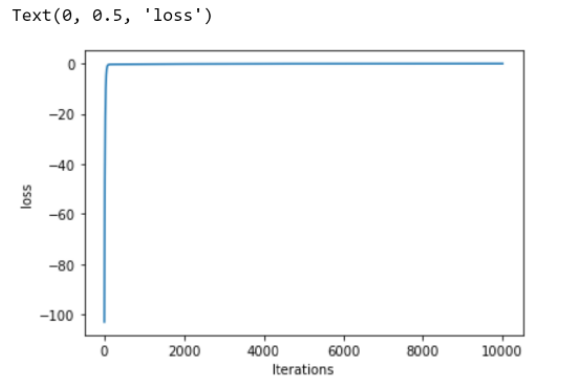
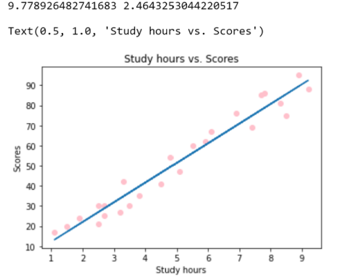

# Implementation-of-Linear-Regression-Using-Gradient-Descent

## AIM:
To write a program to implement the linear regression using gradient descent.

## Equipments Required:
1. Hardware – PCs
2. Anaconda – Python 3.7 Installation / Moodle-Code Runner

## Algorithm
### 1. Use the standard libraries in python for Gradient Design.
### 2.Upload the dataset and check any null value using .isnull() function.
### 3.Declare the default values for linear regression.
### 4.Calculate the loss usinng Mean Square Error.
### 5.Predict the value of y.
### 6.Plot the graph respect to hours and scores using scatter plot function.

## Program:
```
Program to implement the linear regression using gradient descent.
Developed by: Bharath Kumar V
RegisterNumber: 212220040025

import numpy as np
import pandas as pd
import matplotlib.pyplot as plt
data = pd.read_csv("student_scores.csv")
data.head()
data.isnull().sum()
x = data.Hours
x.head()
y = data.Scores
y.head()
n = len(x)
m = 0
c = 0
L = 0.001
loss = []
for i in range(10000):
    ypred = m*x + c
    MSE = (1/n) * sum((ypred - y)*2)
    dm = (2/n) * sum(x*(ypred-y))
    dc = (2/n) * sum(ypred-y)
    c = c-L*dc
    m = m-L*dm
    loss.append(MSE)
    #print(m)
print(m,c)
y_pred = m*x + c
plt.scatter(x,y,color = "pink")
plt.plot(x,y_pred)
plt.xlabel("Study hours")
plt.ylabel("Scores")
plt.title("Study hours vs. Scores")
plt.plot(loss)
plt.xlabel("Iterations")
plt.ylabel("loss")
```


## Output:




## Result:
Thus the program to implement the linear regression using gradient descent is written and verified using python programming.# Ex-02---Implementation-of-Linear-Regression-Using-Gradient-Descent
